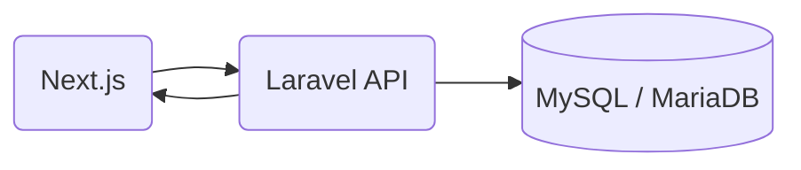

# 📘 Employee Remuneration App

Aplikasi pencatatan pekerjaan pegawai dan perhitungan remunerasi, lengkap dengan pembagian prorata jika lebih dari satu pegawai mengerjakan tugas yang sama.

---

## 📐 Arsitektur Solusi



- **Frontend (Next.js):** Menyediakan antarmuka pengguna untuk input dan melihat data.  
- **Backend (Laravel):** Menyediakan REST API untuk CRUD dan logika perhitungan remunerasi.  
- **Database:** Menyimpan record pekerjaan, pegawai, dan hasil perhitungan remunerasi.

---

## 🎨 Penjelasan Desain

### 🧠 Alasan Pendekatan

Perhitungan remunerasi dilakukan di Laravel backend untuk menjaga konsistensi logika dan validasi.

Jika lebih dari satu pegawai mengerjakan tugas yang sama, maka:

```
total_remuneration = (total jam * rate) + biaya tambahan
```

Masing-masing pegawai mendapat prorata berdasarkan jam kerjanya:

```
(jam kerja pegawai / total jam) * total_remuneration
```

API dibuat modular dengan endpoint CRUD terpisah untuk memudahkan integrasi dengan frontend.

---

## 🛠️ Setup & Deploy

### 🔧 Backend (Laravel)

```bash
cd backend

# Install dependencies
composer install

# Salin file .env dan sesuaikan konfigurasi database dan lainnya
cp .env.example .env

# Generate aplikasi key
php artisan key:generate

# Jalankan migrasi database
php artisan migrate

# Jalankan server lokal
php artisan serve
```

### 💻 Frontend (Next.js)

```bash
cd frontend

# Install dependencies
npm install

# Jalankan server development
npm run dev
```

### 🌐 Environment

Pastikan konfigurasi `.env` pada backend dan frontend sudah mengarah ke URL yang benar, misalnya:

- Laravel API base URL: `http://127.0.0.1:8000`
- Next.js API base URL di `.env.local`:

```
NEXT_PUBLIC_API_BASE_URL=http://127.0.0.1:8000/api
```

---

## 🚧 Tantangan & Solusi

| Tantangan                                              | Solusi                                                        |
|-------------------------------------------------------|---------------------------------------------------------------|
| MassAssignmentException karena field belum masuk $fillable | Menambahkan field seperti employee_name, hours_spent, dll ke model Laravel |
| SQLSTATE[22003] (Out of range for column numeric)    | Mengubah tipe kolom numeric (decimal) di database dengan doctrine/dbal |
| Error migrasi kolom dengan change()                   | Install `doctrine/dbal` agar Laravel bisa modifikasi kolom    |
| Perhitungan remunerasi kompleks                        | Logika prorata dikerjakan di controller Laravel berdasarkan total jam kerja |

---

## 🧪 Contoh Data JSON

```json
{
  "employee_name": "Budi",
  "task_description": "Membuat laporan keuangan",
  "date": "2025-06-09",
  "hours_spent": 5,
  "hourly_rate": 150000,
  "additional_charges": 100000,
  "total_remuneration": 850000
}
```

---

## ✅ Fitur

- Tambah data tugas pegawai  
- Edit dan hapus data  
- Hitung otomatis remunerasi berdasarkan jam kerja  
- Bagi remunerasi secara prorata jika lebih dari satu pegawai  
- Tampilkan detail perhitungan di UI Next.js  

---

## 📎 Lisensi

Proyek ini dibuat untuk keperluan coding challenge dan pendidikan.
